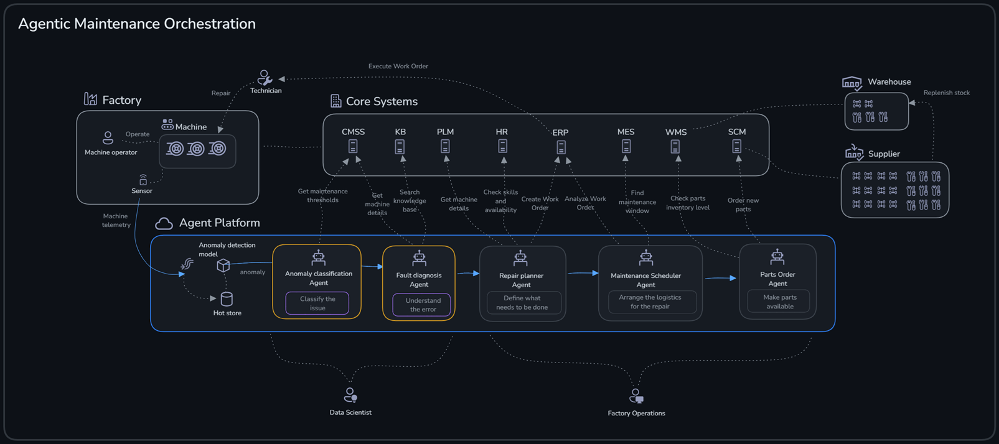
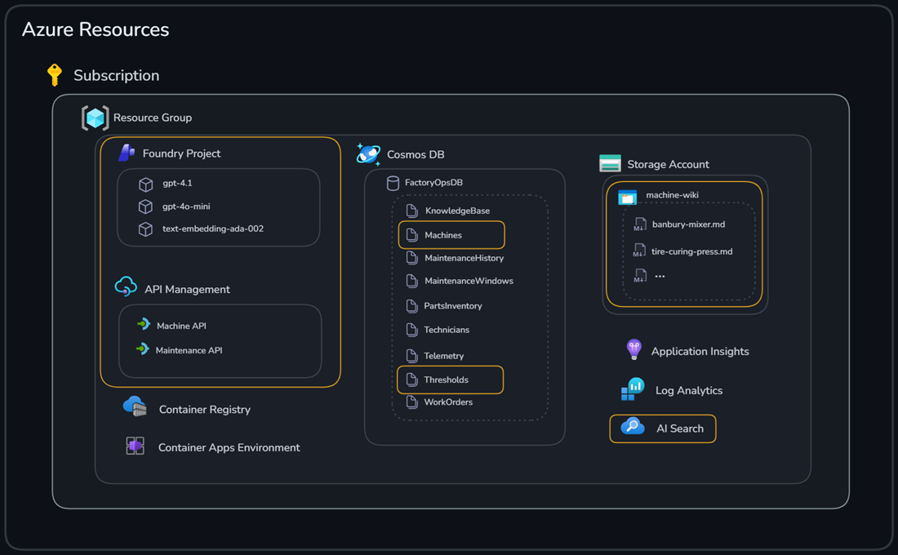
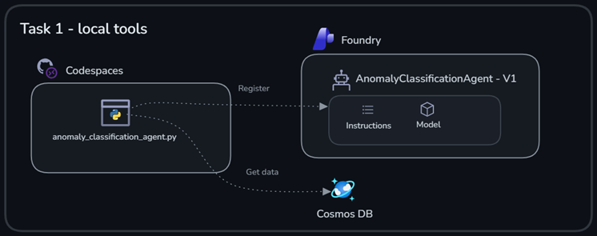
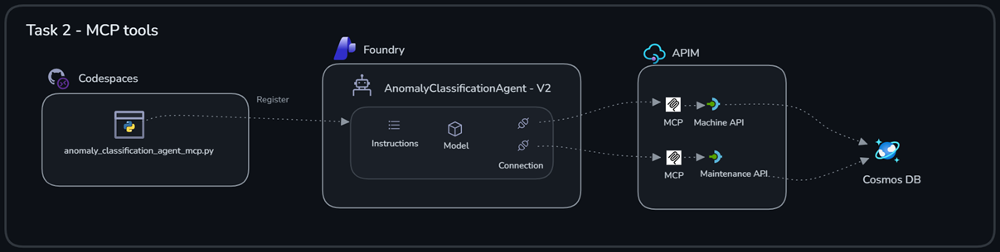
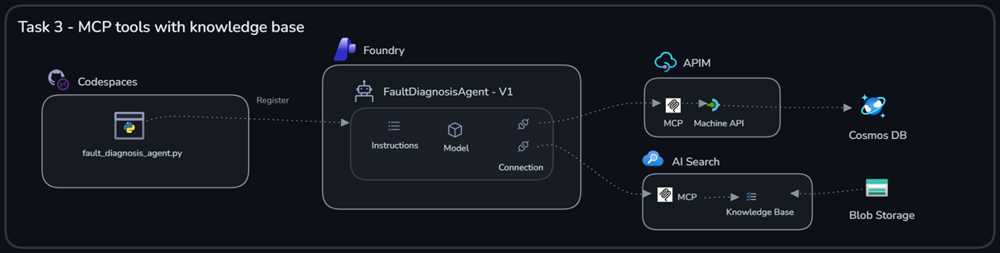

# Challenge 1: Building Agent Framework Agents for Anomaly Classification and Fault Diagnosis

Welcome to Challenge 1!

In this challenge, we will build two specialized agents for classifying and understanding machine anomalies.

**Expected duration**: 60 min
**Prerequisites**: [Challenge 0](../challenge-0/README.md) successfully completed

## 🎯 Objective

The goals for this challenge are:

- Create two Foundry Agents in Python
- Use MCP servers for remote tool invocation
- Learn how Foundry IQ can be used to ground agents with your own data

## 🧭 Context and background information


First, we’ll develop an **Anomaly Classification Agent** to interpret detected anomalies and raise corresponding maintenance alerts. Next, we’ll implement a **Fault Diagnosis Agent** to determine the root cause of an anomaly so you can prepare for maintenance. The agents will use a number of different tools to accomplish their tasks.

You will use the Azure resources highlighted in the image below.


### Model Context Protocol (MCP)

You will also use **Model Context Protocol (MCP)** to connect the agents with remote tools.

MCP is a standard way for an agent to discover and invoke external capabilities ("tools") through a consistent interface. In this challenge, those tools live behind **remote MCP servers** (for example, MCP servers created from API Management operations).

Why we use it here:

- **Decouples the agent from integrations**: the agent calls a tool by name and schema, not by hardcoding HTTP requests.
- **Reusable + portable**: the same agent code can work across environments as long as the MCP server URL/connection is configured.
- **Governance hooks**: tools can be allow-listed and can require (or skip) approval depending on your scenario.

### Grounding with Foundry IQ

You will also ground the agent with data using **Foundry IQ**.

Foundry IQ is a managed knowledge base (an agentic retrieval workload powered by Azure AI Search) that lets your agent retrieve relevant chunks from your own documents at runtime. Instead of pasting wiki content into prompts, the agent issues targeted retrieval requests and uses the returned passages to produce answers that stay aligned with your source material.

In this challenge, we’ll use Foundry IQ to make the **machine wiki** available to the Fault Diagnosis Agent via an MCP tool.


## ✅ Tasks

### Task 1: Create and test initial Anomaly Classification Agent

As a first step, we will create an agent to interpret and classify anomalies and raise maintenance alerts if certain thresholds have been violated. The agent will take anomalies for specific machines as input and check them against thresholds for that machine type by using JSON data stored in Cosmos DB.

---

#### Task 1.1. Review initial code for Anomaly Classification Agent

Examine the Python code in [anomaly_classification_agent.py](./agents/anomaly_classification_agent.py)  
A few things to observe:

- The agent uses two function tools
  - `get_thresholds`: Retrieves specific metric threshold values for certain machine types.
  - `get_machine_data`: Fetches details about machines such as id, model and maintenance history.
- The agent is instructed to output both structured alert data in a specific format and a human readable summary.
- The code will create the agent and run a sample query against it.

---

#### Task 1.2. Run the code

```bash
cd challenge-1
python agents/anomaly_classification_agent.py

```

Verify that the agent responded with a reasonable answer.

---

### Task 2: Equip the agent with MCP tools

Machine and threshold information is typically stored in a central system and exposed through an API. Let's adjust the data access to use an existing Machine and Maintenance APIs instead of accessing a Cosmos DB database directly. In this step you will expose the Machine and Maintenance APIs as Model Context Protocol (MCP) servers for convenient access from the Agent.

---

#### Task 2.1. Test the Machine API

The Machine API and Maintenance API are already available in API Management and contain endpoints for getting details about a specific machine and thresholds for certain machine types. Try the APIs using the following commands:

```bash
# Get all machines
curl -fsSL "$APIM_GATEWAY_URL/machine" -H "Ocp-Apim-Subscription-Key: $APIM_SUBSCRIPTION_KEY" -H "Accept: application/json"

# Get a specific machine
curl -fsSL "$APIM_GATEWAY_URL/machine/machine-001" -H "Ocp-Apim-Subscription-Key: $APIM_SUBSCRIPTION_KEY" -H "Accept: application/json"

# Get thresholds for a machine type 
curl -fsSL "$APIM_GATEWAY_URL/maintenance/tire_curing_press" -H "Ocp-Apim-Subscription-Key: $APIM_SUBSCRIPTION_KEY" -H "Accept: application/json"
```

---

#### Task 2.2. Expose APIs as MCP servers

API Management provides an easy way to expose APIs as MCP servers without writing any additional wrapper code.

1. Navigate to your API Management instance in the [Azure portal](https://portal.azure.com).
2. Choose _APIs_ and notice that _Machine API_ and _Maintenance API_ you tested earlier is available
3. Navigate to the _MCP Servers_ section
4. Click _Create MCP Server_ and _Expose an API as MCP Server_
5. Select API, operations and provide the following details
    - **API**: _Machine API_
    - **API Operations**: _Get Machine_
    - **Display Name**: _Get Machine Data_
    - **Name**: _get-machine-data_
    - **Description**: _Gets details about a specific machine_
6. Click _Create_
7. Finally, save the _MCP Server URL_ of the newly created MCP server, you will need it in the next part. Add a new entry with the value in the _.env_ file `MACHINE_MCP_SERVER_ENDPOINT=<MCP_SERVER_URL>`

Perform the same steps to create the _Maintenance_ MCP server using the following settings:

- **API**: _Maintenance API_
- **API Operations**: _Get Threshold_
- **Display Name**: _Get Maintenance Data_
- **Name**: _get-maintenance-data_
- **Description**: _Gets maintenance data such as thresholds for maintenance alerts_

Save the _MCP Server URL_ of the MCP server as `MAINTENANCE_MCP_SERVER_ENDPOINT=<MCP_SERVER_URL>`

Reload the environment variables from file to make the new environment variables available in the shell

```bash
export $(cat ../.env | xargs)
```

---

#### Task 2.3. Use the MCP Servers from the agent

Now it’s time to replace the direct database access with our new Machine and Maintenance MCP Servers. The MCP servers will be added as tools to the Anomaly Classification Agent.

Examine the Python code in [anomaly_classification_agent_mcp.py](./agents/anomaly_classification_agent_mcp.py)  
A few things to observe:

- The agent uses two MCP tools
  - `machine-data`: Fetches details about machines such as id, model and maintenance history.
  - `maintenance-data`: Retrieves specific metric threshold values for certain machine types.
- A project connection is created for the MCP tools

---

#### Task 2.4. Test the agent with MCP tool

Run the code

```bash
python agents/anomaly_classification_agent_mcp.py

```

Verify that the agent responed with a correct answer.
Verify that the agent responded with a correct answer.

---

#### Task 2.5. Review and test the agent in Foundry Portal

1. Navigate to [Microsoft Foundry Portal](https://ai.azure.com).

> [!TIP]
> Enable the new portal experience using the toggle in the upper right corner.

1. Select the _build_ tab to list available agents
2. Examine the configuration details for **AnomalyClassificationAgent** you just created.
3. Try out some additional questions in the playground:

- Normal condition (no maintenance needed). Use query `Hello, can you classify the following metric for machine-002: [{"metric": "drum_vibration", "value": 2.1}]`
- Critical anomaly. Use query `Hello, can you classify the following metric for machine-005: [{"metric": "mixing_temperature", "value": 175}]`
- Non existing machine. Use query `Hello, can you classify the following anomalies for machine-007: [{"metric": "curing_temperature", "value": 179.2},{"metric": "cycle_time", "value": 14.5}]`
- Non-existent machine. Use query `Hello, can you classify the following anomalies for machine-007: [{"metric": "curing_temperature", "value": 179.2},{"metric": "cycle_time", "value": 14.5}]`

---

### Task 3: Understand root cause with Fault Diagnosis Agent and Foundry IQ

The next agent we'll create, **Fault Diagnosis Agent**, is tasked to understand the actual root cause of the issues alerted from the **Anomaly Classification Agent**. Besides machine data and maintenance history we'll add a machine wiki as a tool for the agent by leveraging **Foundry IQ**.

#### Task 3.1. Examine the machine data wiki

The machine wiki contains knowledge (common issues, repair instructions and repair details) about different machine types. The wiki pages are available as markdown files in **Azure Blob Storage**. Take a moment to review the content:

1. Navigate to [Azure Portal](https://portal.azure.com) and locate the storage account.
2. Select _Storage browser_ / _Blob containers_ and select the _machine-wiki_ container  
3. Select a wiki article and select the _Edit_ tab to preview the content

---

#### Task 3.2. Expose the machine wiki data as a knowledge base

**Foundry IQ** consists of knowledge sources (_what_ to retrieve) and knowledge bases (_how_ to retrieve). Knowledge sources are created as standalone objects and then referenced in a knowledge base.

> [!NOTE]
> [Foundry Agent Service](https://learn.microsoft.com/en-us/azure/ai-foundry/agents/overview?view=foundry) orchestrates calls to the knowledge base via the MCP tool and synthesizes the final answer. At runtime, the agent calls only the knowledge base, not the data platform (such as **Azure Blob Storage** in our case) that underlies the knowledge source. The knowledge base handles all retrieval operations.

Create a knowledge source and knowledge base using the [create_knowledge_base.ipynb](./create_knowledge_base.ipynb) notebook.

---

#### Task 3.3. Create the Fault Diagnosis Agent

Let's create the **Fault Diagnosis Agent** and use our newly created Foundry IQ knowledge base.

Examine the Python code in [fault_diagnosis_agent.py](./agents/fault_diagnosis_agent.py)  

Currently only one tool `machine_data` is available. Your task is to add the knowledge base MCP tool to the agent so the machine wiki content can be used when diagnosing the root cause of the anomaly.

1. Locate placeholder comment `# TODO: add Foundry IQ MCP tool`  in [fault_diagnosis_agent.py](./agents/fault_diagnosis_agent.py)
2. Add the knowledge base as an `MCPTool` by updating the placeholder with the following code

    ```python
    
    MCPTool(
        server_label="machine-wiki",
        server_url=machine_wiki_mcp_endpoint,
        require_approval="never",
        project_connection_id="machine-wiki-connection"
    )
    ```

A few things to observe:

- The agent now uses two MCP tools
  - `knowledge_base`: Retrieves machine wiki information for root cause analysis.
  - `machine_data`: Fetches details about machines such as id, model and maintenance history.
- The agent is clearly instructed to use our machine knowledge base instead of its own knowledge.

Run the code:

```bash
python agents/fault_diagnosis_agent.py 

```

Verify the answer from the agent

## 🛠️ Troubleshooting and FAQ

<details>
<summary>Problem: the agent doesn't show up in the new Foundry Portal</summary>
There can be a certain delay before newly created agents are visible in the Foundry Portal. If you don't see the agent after 10 minutes, try refreshing the browser or run the Python script again.
</details>

<details>
<summary>Problem: `PermissionDenied` denied when running agent creation Python scripts</summary>
Make sure you have assigned yourself the AI Developer role on the Foundry Project.
</details>


## 🧠 Conclusion and reflection


🎉 Congratulations! You've successfully built two agents and equipped them with enterprise tools to perform their tasks.

Let’s quickly recap what we did.

In [Task 1](#task-1-create-and-test-initial-anomaly-classification-agent) we created the **Anomaly Classification Agent** using a Python script.



The agent had a system prompt with instructions how to behave and had two _local_ tools to be able to query Cosmos DB data. When running the Python script the tools executed locally in the Python process. If you were to ask the same questions in the Foundry Portal playground the agent wouldn't be able to answer since the tools are not available there.

The agent had a system prompt with instructions on how to behave and had two _local_ tools to query Cosmos DB data. When you ran the Python script, the tools executed locally in the Python process. If you ask the same questions in the Foundry Portal playground, the agent would not be able to answer because the tools are not available there.

In [Task 2](#task-2-equip-the-agent-with-mcp-tools), we published the APIs as MCP servers in **API Management** and connected them to the Foundry project.


The **Anomaly Classification Agent** could then run fully in Agent Service and hence the questions asked in the Foundry Playground worked. 

The **Anomaly Classification Agent** could then run fully in Agent Service, so the questions asked in the Foundry Playground worked.

The **Anomaly Classification Agent** could therefore use them as _remote_ tools over MCP

Finally, in [Task 3](#task-3-understand-root-cause-with-fault-diagnosis-agent-and-foundry-iq) we created the **Fault Diagnosis Agent** and grounded with data via **AI Search** exposed as an MCP server.



This agent also runs fully in Agent Service and can use the tools when answering questions in the playground. Note that the content from Blob Storage isn’t fetched on demand — instead, it’s indexed ahead of time, and retrieval queries are executed against AI Search.

If you want to expand your knowledge on what we’ve covered in this challenge, have a look at the content below:

- [Create a knowledge base in Azure AI Search](https://learn.microsoft.com/en-us/azure/search/agentic-retrieval-how-to-create-knowledge-base?tabs=rbac&pivots=python)
- [What is a knowledge source?](https://learn.microsoft.com/en-us/azure/search/agentic-knowledge-source-overview)
- [Connect to Model Context Protocol servers](https://learn.microsoft.com/en-us/azure/ai-foundry/agents/how-to/tools/model-context-protocol?view=foundry&pivots=python)
- [Connect a Foundry IQ knowledge base to Foundry Agent Service](https://learn.microsoft.com/en-us/azure/ai-foundry/agents/how-to/tools/knowledge-retrieval?view=foundry&tabs=foundry%2Cpython)

**Next step:** [Challenge 2](../challenge-2/README.md) - Building the Repair Planner Agent with GitHub Copilot
