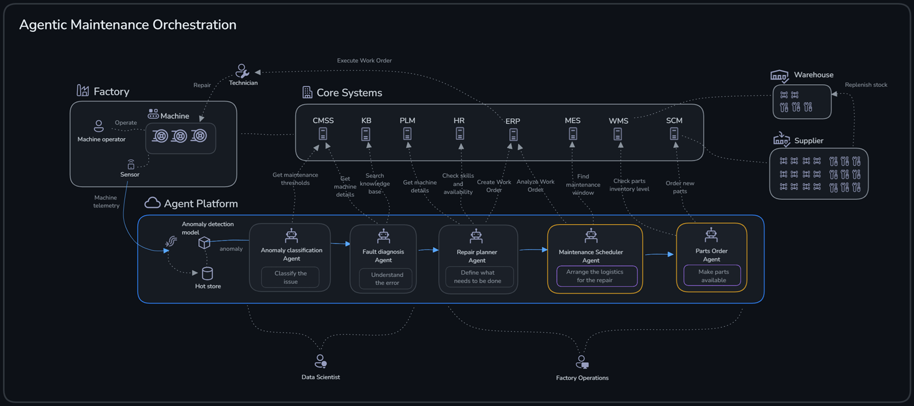
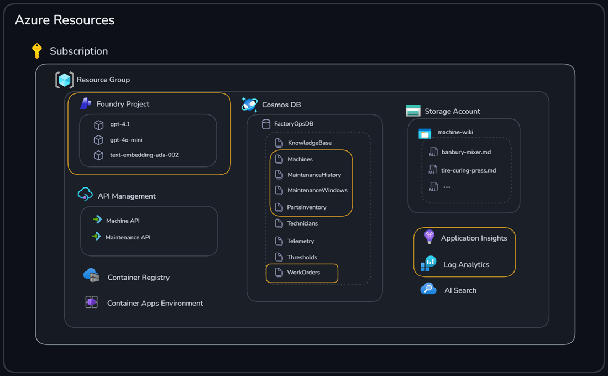
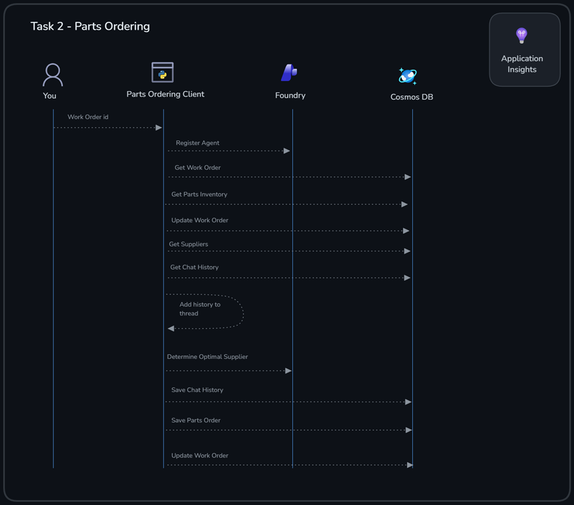
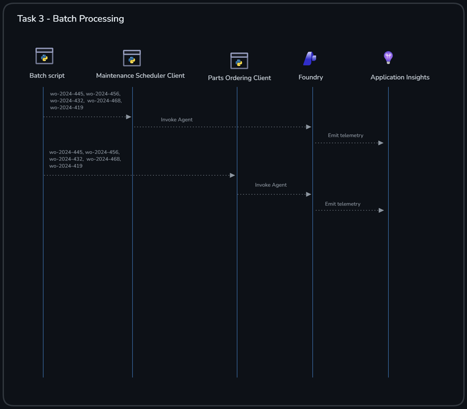

# Challenge 3: Maintenance Scheduler & Parts Ordering Agents

Welcome to Challenge 3!

In this challenge, you'll work with two specialized AI agents that optimize factory operations through intelligent maintenance scheduling and automated supply chain management.

**Expected Duration:** 60 minutes
**Prerequisites**: [Challenge 0](../challenge-0/challenge-0.md) successfully completed

## 🎯 Objective

The goals for this challenge are:

- Create two Foundry agents using Python
- Use Agent memory
- Examine Agent observability


## 🧭 Context and background information



The **Maintenance Scheduler Agent** analyzes work orders and historical maintenance data to find optimal maintenance windows that minimize production disruption.
The **Parts Ordering Agent** checks inventory levels for required parts, evaluates supplier performance and lead times, and generates optimized parts orders with cost analysis.

You will use the Azure resources highlighted in the image below.


Both agents interact with Azure Cosmos DB as their primary data store.

<details>
<summary>Containers Used</summary>

| Container | Purpose | Agent Usage |
|-----------|---------|-------------|
| **WorkOrders** | Work orders from Repair Planner | Read by both agents to get job details |
| **Machines** | Equipment information | Referenced for machine context |
| **MaintenanceHistory** | Historical maintenance records | Read by Maintenance Scheduler for pattern analysis |
| **MaintenanceWindows** | Available production windows | Read by Maintenance Scheduler to find optimal timing |
| **MaintenanceSchedules** | Generated maintenance schedules | **Written by Maintenance Scheduler** |
| **PartsInventory** | Current stock levels | Read by Parts Ordering to check availability |
| **Suppliers** | Supplier information | Read by Parts Ordering for sourcing decisions |
| **PartsOrders** | Generated parts orders | **Written by Parts Ordering Agent** |

</details>

<details>
<summary>Data Flow</summary>

```
┌─────────────────────────────────────────────────────────────────────────────┐
│                        MAINTENANCE SCHEDULER AGENT                          │
└─────────────────────────────────────────────────────────────────────────────┘

Input (READ):                         Output (WRITE):
├─ WorkOrders                         ├─ MaintenanceSchedules
├─ MaintenanceHistory                 │  └─ scheduled_date
├─ MaintenanceWindows                 │  └─ risk_score (0-100)
└─ Machines                            │  └─ predicted_failure_probability
                                      │  └─ recommended_action
                                      │  └─ maintenance_window
                                      │  └─ reasoning
                                      └─ WorkOrders (status update to 'Scheduled')

┌─────────────────────────────────────────────────────────────────────────────┐
│                          PARTS ORDERING AGENT                               │
└─────────────────────────────────────────────────────────────────────────────┘

Input (READ):                         Output (WRITE):
├─ WorkOrders                         ├─ PartsOrders
├─ PartsInventory                     │  └─ supplier_id, supplier_name
├─ Suppliers                          │  └─ order_items (part, qty, cost)
└─ Machines                            │  └─ total_cost
                                      │  └─ expected_delivery_date
                                      │  └─ reasoning
                                      └─ WorkOrders (status update to 'PartsOrdered' or 'Ready')
```

</details>

---

### Azure AI Tracing & Observability

Both agents are instrumented for **end-to-end observability** so you can debug runs and understand model behavior without adding print statements everywhere.

What you get in traces:

- **Agent execution timeline**: each step (read data, reason, write results)
- **AI model calls**: prompts, responses, token usage, and latency (when enabled)
- **Cosmos DB operations**: reads/writes to containers used by the agents
- **Failures with context**: exceptions + which step failed

How tracing is enabled:

Tracing is designed to be **automatic when configured**: if the tracing dependencies are present and an Application Insights connection string is available, the agents will emit rich traces covering both the workflow steps and model calls.

## ✅ Tasks

### Task 1: Maintenance Scheduler Agent

The Maintenance Scheduler Agent analyzes work orders and determines the optimal time to perform maintenance by balancing equipment reliability needs against production impact.

What it does

1. **Reads Work Order** from `WorkOrders` container
2. **Analyzes Historical Data** from `MaintenanceHistory` container to understand failure patterns
3. **Checks Available Windows** from `MaintenanceWindows` container to find low-impact periods
4. **Runs AI Analysis** using Microsoft Agent Framework to assess risk and recommend timing
5. **Saves Schedule** to `MaintenanceSchedules` container with risk scores and recommendations
6. **Updates Work Order** status to 'Scheduled'

---

#### Task 1.1 Run the Agent

```bash
cd /workspaces/factory-hack/challenge-3
python agents/maintenance_scheduler_agent.py wo-2024-456
```

---

#### Task 1.2 Review the output

<details>
<summary>Example console output</summary>

```text
=== Predictive Maintenance Agent ===

📊 Agent Framework tracing enabled (Azure Monitor)
   Traces sent to: InstrumentationKey=...
   View in Azure AI Foundry portal: https://ai.azure.com -> Your Project -> Tracing

   Checking existing agent versions in portal...
   Found existing version: 1.0
   Creating new version: 2.0
   Registering MaintenanceSchedulerAgent v2.0 in Azure AI Foundry portal...
   ✅ MaintenanceSchedulerAgent v2.0 registered successfully!

1. Retrieving work order...
   ✓ Work Order: WO-001
   Machine: machine-001
   Fault: Temperature Sensor Malfunction
   Priority: high

2. Analyzing historical maintenance data...
   ✓ Found 3 historical maintenance records

3. Checking available maintenance windows...
   ✓ Found 17 available windows in next 14 days

4. Running AI predictive analysis...
   ✓ Analysis complete!

=== Predictive Maintenance Schedule ===
Schedule ID: sched-1735845678
Machine: machine-001
Scheduled Date: 2026-01-04 22:00
Window: 22:00 - 06:00
Production Impact: Low
Risk Score: 85/100
Failure Probability: 70.0%
Recommended Action: URGENT

Reasoning:
Given the high priority work order and historical pattern of temperature sensor 
failures on machine-001, immediate scheduling is recommended. The selected 
weekend night window (Saturday 10PM - Sunday 6AM) minimizes production impact 
while addressing the critical temperature sensor issue before potential failure.

5. Saving maintenance schedule...
   ✓ Schedule saved to Cosmos DB

6. Updating work order status...
   ✓ Work order status updated to 'Scheduled'

✓ Predictive Maintenance Agent completed successfully!
```

</details>

What Gets Saved to Cosmos DB:

<details>
<summary>Example documents written/updated (Cosmos DB)</summary>

**MaintenanceSchedules Container:**

```json
{
   "id": "sched-1735845678",
   "workOrderId": "WO-001",
   "machineId": "machine-001",
   "scheduledDate": "2026-01-04T22:00:00Z",
   "maintenanceWindow": {
      "id": "mw-2026-01-04-night",
      "startTime": "2026-01-04T22:00:00Z",
      "endTime": "2026-01-05T06:00:00Z",
      "productionImpact": "Low"
   },
   "riskScore": 85.0,
   "predictedFailureProbability": 0.70,
   "recommendedAction": "URGENT",
   "reasoning": "Given the high priority work order and historical pattern...",
   "createdAt": "2026-01-02T15:30:00Z"
}
```

**WorkOrders Container (Updated):**

```json
{
   "id": "WO-001",
   "machineId": "machine-001",
   "status": "Scheduled",  // ← Updated from "Created"
   ...
}
```

</details>

---

### Task 2: Run Parts Ordering Agent

The Parts Ordering Agent checks inventory availability and generates optimized parts orders by evaluating supplier reliability, lead times, and costs.

What it does

1. **Reads Work Order** from `WorkOrders` container to get required parts
2. **Checks Inventory** from `PartsInventory` container to determine what's in stock
3. **Identifies Missing Parts** that need to be ordered
4. **Finds Suppliers** from `Suppliers` container that can provide the parts
5. **Runs AI Analysis** to optimize supplier selection based on reliability, lead time, and cost
6. **Saves Parts Order** to `PartsOrders` container with order details
7. **Updates Work Order** status to 'PartsOrdered' (or 'Ready' if all parts available)

#### Task 2.1: Run the Agent

```bash
cd /workspaces/factory-hack/challenge-3
python agents/parts_ordering_agent.py wo-2024-456
```

#### Task 2.2: Review expected output

When parts need ordering:

<details>
<summary>Example output (parts need ordering)</summary>

```text
=== Parts Ordering Agent ===

1. Retrieving work order...
   ✓ Work Order: WO-002
   Machine: machine-002
   Required Parts: 2
   Priority: medium

2. Checking inventory status...
   ✓ Found 2 inventory records

⚠️  2 part(s) need to be ordered:
   - Drum Bearing (Qty: 1)
   - Tension Sensor Module (Qty: 1)

3. Finding suppliers...
   ✓ Found 3 potential suppliers

4. Running AI parts ordering analysis...
   ✓ Parts order generated!

=== Parts Order ===
Order ID: po-1735845789
Work Order: WO-002
Supplier: Industrial Parts Co (ID: SUP-001)
Expected Delivery: 2026-01-07
Total Cost: $1340.00
Status: Pending

Order Items:
  - Drum Bearing (#PART-006)
    Qty: 1 @ $890.00 = $890.00
  - Tension Sensor Module (#PART-005)
    Qty: 1 @ $450.00 = $450.00

5. Saving parts order...
   ✓ Order saved to SCM system

6. Updating work order status...
   ✓ Work order status updated to 'PartsOrdered'

✓ Parts Ordering Agent completed successfully!
```

</details>

When All Parts Available:

<details>
<summary>Example output (all parts available)</summary>

```text
=== Parts Ordering Agent ===

1. Retrieving work order...
   ✓ Work Order: WO-001
   Machine: machine-001
   Required Parts: 1
   Priority: high

2. Checking inventory status...
   ✓ Found 1 inventory records

✓ All required parts are available in stock!
No parts order needed.

3. Updating work order status...
   ✓ Work order status updated to 'Ready'

✓ Parts Ordering Agent completed successfully!
```

</details>

What Gets Saved to Cosmos DB:

<details>
<summary>Example documents written/updated (Cosmos DB)</summary>

**PartsOrders Container:**

```json
{
   "id": "po-1735845789",
   "workOrderId": "WO-002",
   "supplierId": "SUP-001",
   "supplierName": "Industrial Parts Co",
   "orderItems": [
      {
         "partNumber": "PART-006",
         "partName": "Drum Bearing",
         "quantity": 1,
         "unitCost": 890.00,
         "totalCost": 890.00
      },
      {
         "partNumber": "PART-005",
         "partName": "Tension Sensor Module",
         "quantity": 1,
         "unitCost": 450.00,
         "totalCost": 450.00
      }
   ],
   "totalCost": 1340.00,
   "expectedDeliveryDate": "2026-01-07T00:00:00Z",
   "orderStatus": "Pending",
   "reasoning": "Selected Industrial Parts Co based on high reliability rating...",
   "createdAt": "2026-01-02T15:35:00Z"
}
```

**WorkOrders Container (Updated):**

```json
{
   "id": "WO-002",
   "machineId": "machine-002",
   "status": "PartsOrdered",  // ← Updated from "Created"
   ...
}
```

</details>

---

### Task 3: Azure AI Tracing & Observability

This challenge uses Azure AI Foundry tracing so you can inspect runs in the portal.

> [!TIP]
> See the AI Tracing and Observability background overview in the [Context and background](#azure-ai-tracing--observability) section

#### Task 3.1: Generate traces

- Run either agent normally (Tasks 1 and 2).
- To generate multiple traces quickly:

```bash
python run-batch.py
```

#### Task 3.2: View traces in Azure AI Foundry

1. Go to <https://ai.azure.com>
2. Select your project
3. Selcte _Agents_ and then `MaintenanceSchedulerAgent` or `PartsOrderingAgent` 
4. Go to _Monitor_ tab

You should see someting similar to this


---

## 🛠️ Troubleshooting and FAQ

<details>
<summary>Disable tracing (local)</summary>

```bash
unset APPLICATIONINSIGHTS_CONNECTION_STRING
```

</details>

## 🧠 Conclusion and reflection

🎉 Congratulations! You've successfully worked with two agents that integrate with Cosmos DB and include production-ready observability.

Let’s quickly recap what we did.

In [Task 1](#task-1-maintenance-scheduler-agent) we created the **Maintenance Scheduler Agent** to analyze work orders, look at historical maintenance patterns, find low-impact maintenance windows, and then save a schedule back to Cosmos DB.


In [Task 2](#task-2-run-parts-ordering-agent) we created the **Parts Ordering Agent** to check required parts, validate what’s already in inventory, select an optimized supplier plan, and write a parts order back to Cosmos DB.



Finally, in [Task 3](#task-3-azure-ai-tracing--observability) we used **Azure AI Foundry tracing** to observe the end-to-end workflow, including data access and model calls.



You've learned how to:

- **Read from Cosmos DB** - Query work orders, history, inventory, and supplier data
- **Write to Cosmos DB** - Save generated schedules and parts orders
- **Update existing records** - Change work order status based on agent actions
- **Use Microsoft Agent Framework** - Modern agent architecture with `ChatAgent`
- **Integrate with Azure AI Foundry** - Run agents with integrated tracing
- **Build data-driven agents** - Combine database queries with AI analysis
- **Handle multiple containers** - Work with complex data relationships
- **Implement tracing & observability** - Monitor agent performance and model usage

If you want to expand your knowledge on what we’ve covered in this challenge, have a look at the content below:

- [Azure AI Foundry Tracing Documentation](https://learn.microsoft.com/azure/ai-foundry/how-to/develop/trace-agents-sdk)
- [Application Insights Overview](https://learn.microsoft.com/azure/azure-monitor/app/app-insights-overview)
- [Microsoft Agent Framework Documentation](https://learn.microsoft.com/azure/ai-foundry/how-to/develop/agent-framework)
- [Cosmos DB Best Practices](https://learn.microsoft.com/azure/cosmos-db/nosql/best-practice-dotnet)

---
**Next step:** [Challenge 4](../challenge-3/challenge-4.md) - Multi-Agent Orchestration
