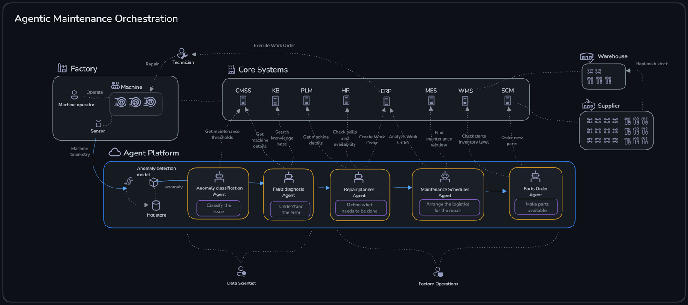
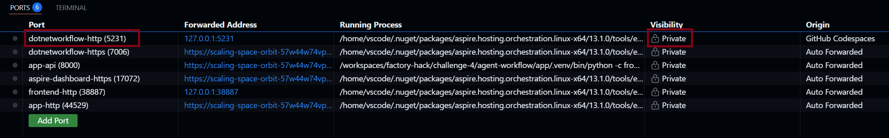
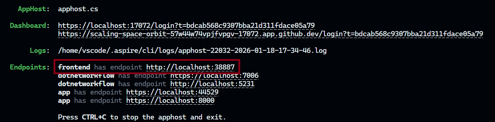
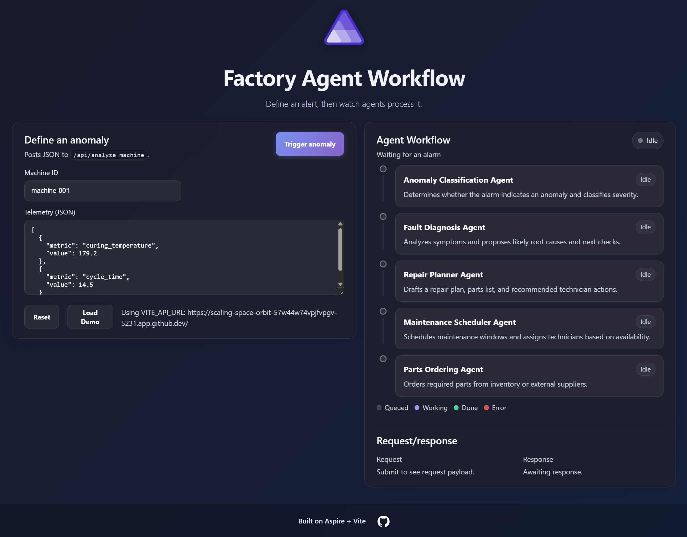
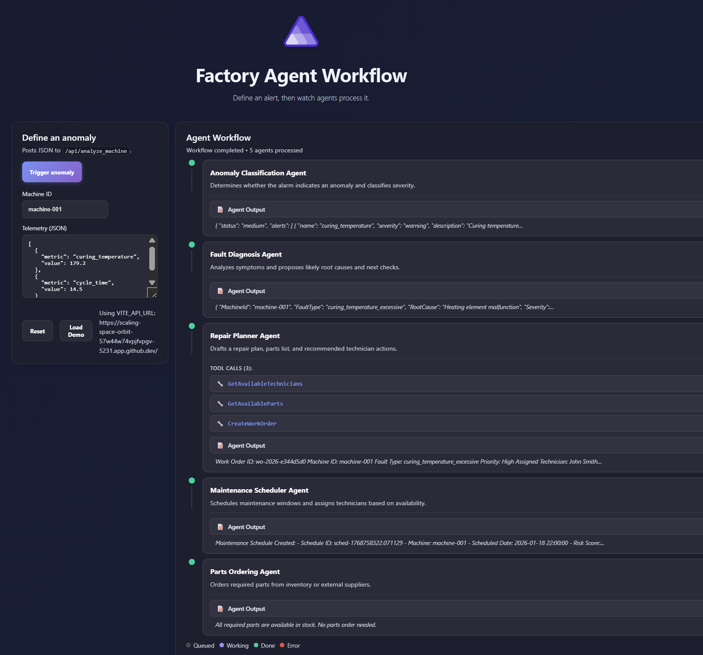
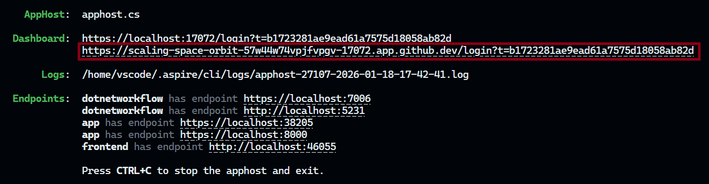
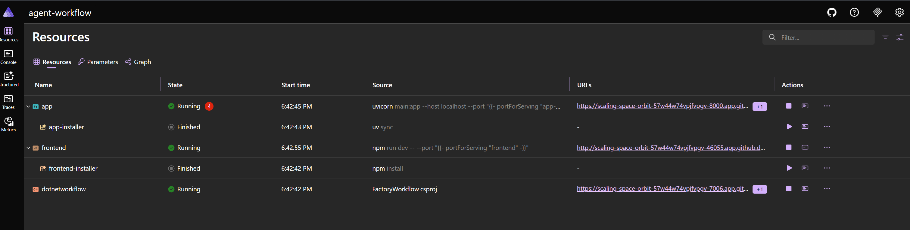
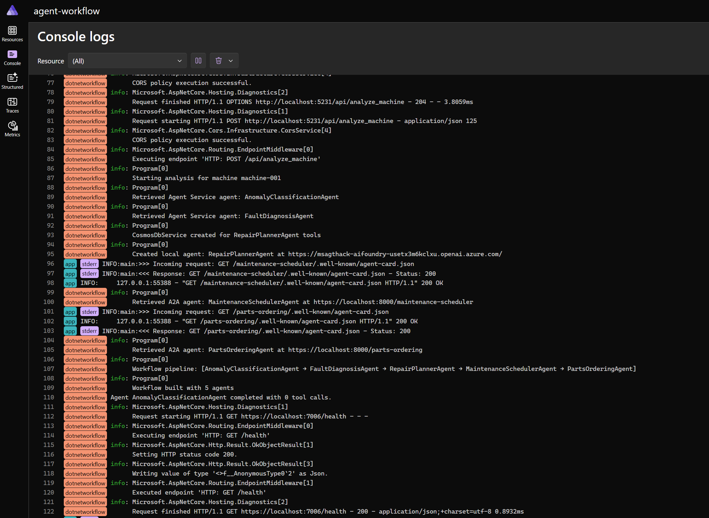

# Challenge 4: End-to-End Agent Workflow with Aspire

Welcome to Challenge 4!

In this challenge, you’ll run a complete **agent framework workflow** that ties together everything you’ve built so far—multiple agents, multiple tech stacks, multiple hosting models—into a single application experience.

**Expected duration**: 45–60 min  
**Prerequisites**: 
- [Challenge 0](../challenge-0/README.md) successfully completed 
- [Challenge 1](../challenge-1/README.md) successfully completed 

## 🎯 Objective

The goals for this challenge are:

- Run an Aspire-hosted **Agent Framework** workflow end-to-end
- Understand how different agent types and hosting models work together
- Observe execution via the Aspire dashboard and traces

## 🧭 Context and background information



At a high level, each agent contributes a specific capability to the workflow:

- **Anomaly Classification Agent**: determines whether incoming telemetry indicates an anomaly, and classifies severity.
- **Fault Diagnosis Agent**: interprets the anomaly signals and proposes likely root causes and next checks.
- **Repair Planner Agent**: drafts a repair plan (tasks, parts, and recommended technician actions), with direct access to operational data.
- **Maintenance Scheduler Agent**: selects maintenance windows and assigns technicians based on availability.
- **Parts Ordering Agent**: reserves/requests required parts from inventory or suppliers.

Challenge 4 demonstrates how a “real application” can orchestrate multiple agents in a workflow—where agents are not the product UI, but capabilities that enhance the solution.

Now we put all previously used Azure Resources in action.


### Why Aspire (workflow host)

We use **.NET Aspire** as the host for the workflow. Aspire is an opinionated framework for building distributed applications, and it’s a good fit here because:

- It gives a consistent developer experience for running multi-service apps locally.
- It provides a built-in dashboard for observability.
- It supports polyglot solutions (this repo includes both **.NET** and **Python** components).

In practice, that means Aspire can orchestrate both **.NET services** and **Python processes** side-by-side, which is exactly what we need for this multi-agent workflow.

In other words, Aspire is the “glue” that runs the workflow host, API, UI, and agent processes together and gives you one place to see logs, health, and traces. For agentic systems, that observability is especially useful because a single user action can fan out into multiple agent calls and tool invocations.

### Agent-to-Agent (A2A) invocation (how agents collaborate)

This solution includes different types of agents:

- **Anomaly Classification Agent** and **Fault Diagnosis Agent**
	- Defined in Python
	- Running fully in **Azure AI Foundry Agent Service** (no local execution)
- **Repair Planner Agent**
	- Implemented in C#
	- Runs with local logic and direct access to data sources like Cosmos DB
	- Invoked from the workflow using **Agent-to-Agent (A2A)**
- **Maintenance Scheduler Agent** and **Parts Ordering Agent**
	- Python agents with local logic
	- Invoked with **A2A** similar to the Repair Planner Agent

**A2A** is a pattern for letting a workflow invoke an agent through a consistent interface, so you can combine independently implemented agents without tightly coupling everything together.

This matters in a polyglot setup: the workflow can call an agent implemented in a different language (or hosted in a different process) the same way it calls any other agent. It also gives you a clean boundary between orchestration (the workflow) and capabilities (the agents), which makes the system easier to evolve over time.

## ✅ Tasks

> [!IMPORTANT]
> The Challenge 4 workflow expects the **Anomaly Classification** and **Fault Diagnosis** agents to be hosted in **Azure AI Foundry Agent Service**.
> Make sure you have completed [Challenge 1](../challenge-1/README.md) before starting the workflow.

### Task 1: Workflow configuration

Set the following environment variables (for example via a `.env` file in `challenge-4/agent-workflow/app/`):

- `AZURE_AI_PROJECT_ENDPOINT` – your Foundry project endpoint

### Task 2: Start Aspire

From the repo root:

```bash
cd challenge-4/agent-workflow
aspire run
```

### Task 3: Make the workflow API port public (Codespaces)

The workflow API runs on port **5231**. In VS Code / Codespaces:



- Open the **Ports** tab
- Find port `5231`
- Set **Port Visibility** to **Public**

> This allows the frontend to call the API from the browser.

### Task 4: Open the frontend

Once Aspire is running, it will provide links in the output.

- Click the **frontend** link
- You should see an app similar to the screenshot below



- Click the link (using ALT+Click)
The Factory Workflow UI opens in your browser


### Task 5. Run the workflow
Click the _Trigger Anomaly_ button
In the frontend, watch the **Agent Workflow** panel as the workflow progresses:

- Anomaly Classification Agent
- Fault Diagnosis Agent
- Repair Planner Agent
- Maintenance Scheduler Agent
- Parts Ordering Agent

You should see steps move through states (queued/working/done/error), tool calls and a request/response payload summary.

When finished you should see something similar to this


### Task 6: View the dashboard

Aspire includes a dashboard to observe running services.

- In the Aspire output, click the **dashboard** link (using ALT+Click)


The dashboard will start in your browser and show the resources


- Click on _Console_ and you will see the invocation chain in the workflow


## 🛠️ Troubleshooting and FAQ

<details>
<summary>Problem: <code>aspire</code> / <code>aspire run</code> is not found</summary>

If the `aspire` command isn’t available in your shell, install it and restart your shell session:

```bash
curl -fsSL https://aspire.dev/install.sh | bash -s
```

Then restart the shell (so the updated PATH is picked up).

If you’re using a `.env` file, load it into your current shell session:

```bash
export $(cat .env | xargs)
```

</details>

<details>
<summary>Problem: I get HTTP 401 / PermissionDenied calling model endpoints</summary>

This usually means your identity is missing Azure OpenAI data-plane permissions on the **Azure OpenAI resource**.

Ensure you have **Cognitive Services OpenAI Contributor** (or **Cognitive Services OpenAI User**) assigned at the Azure OpenAI resource scope.

See: [Challenge 0 – Task 7: Assign additional permissions](../challenge-0/README.md#task-7-assign-additional-permissions)

</details>

<details>
<summary>Problem: The frontend loads, but calls to /api fail</summary>

- Confirm port `5231` is forwarded and set to **Public** in the Ports view.
- Confirm the frontend is pointing at the correct API URL.
- Check Aspire dashboard logs for CORS or network errors.

</details>

<details>
<summary>Problem: The workflow can’t find my Foundry project endpoint</summary>

Make sure `AZURE_AI_PROJECT_ENDPOINT` is set in the shell that runs `aspire run`.

```bash
echo "$AZURE_AI_PROJECT_ENDPOINT"
```

</details>

## 🧠 Conclusion and reflection

🎉 Congratulations! You’ve successfully run an end-to-end, polyglot agent workflow hosted with Aspire.


The diagram above illustrates the full workflow in 9 steps:

1. A user triggers a sample anomaly in the Aspire **Factory Agent UI** (sample machine + sample metrics).
2. The **agent framework workflow** (implemented in .NET) is triggered.
3. The workflow invokes the **Anomaly Classification Agent** running in **Agent Service**.
4. The Anomaly Classification Agent uses **remote MCP tools** to call APIM and fetch required data.
5. The workflow invokes the **Fault Diagnosis Agent** running in **Agent Service**.
6. The Fault Diagnosis Agent uses **remote MCP tools** to call APIM and query **Azure AI Search**.
7. The workflow invokes the **Repair Planner Agent** locally via **A2A**, running in a separate .NET process. It still uses the agent registration in Foundry, but executes its logic locally.
8. The Repair Planner Agent queries **Cosmos DB** locally to retrieve operational data.
9. The final two agents (**Maintenance Scheduler** and **Parts Ordering**) are implemented in Python and also run locally in a separate process (similar to Repair Planner). They’re invoked via **A2A** and query Cosmos DB directly.

In this challenge we run Aspire locally for development, but the same pattern can be deployed as a hosted application (for example as a containerized workload in Azure Container Apps). If you want an optional stretch goal, try packaging the workflow host + frontend and deploying it. The lab environment in Azure containes both an **Azure Container Registry** and a **Container Apps Environment**.

In this challenge, you built and ran a solution where agents are **part of the application**, not the entire application.

- **Choosing different tech stacks is a feature, not a bug**: you can implement agents in Python or C# depending on what they need to do (data access, performance, existing libraries, team skills).
- **Agents can be polyglots**: different agents can be built in different languages and still work together through standard invocation patterns (like A2A).
- **This is close to traditional application development**: you still assemble services, define interfaces, configure environments, and diagnose issues with logs and traces—agents simply enhance the solution’s capabilities.

If you want to expand your knowledge on what we’ve covered in this challenge, have a look at the content below:

- https://aspire.dev/get-started/what-is-aspire/
- https://learn.microsoft.com/en-us/azure/ai-foundry/agents/how-to/tools/agent-to-agent?view=foundry&pivots=python

Congratulations! 🎉 You’ve successfully completed the final challenge of the Factory maintenance multi-agent workflow workshop. You now have a complete, end-to-end agentic system that combines:

- **🤖 AI-powered agents** for anomaly detection, diagnosis, and planning
- **🔌 MCP integration** for governed, extensible tool connectivity
- **📊 Observability** with Aspire dashboard + traces to monitor and debug execution
- **🖥️ A web frontend** for business-user interaction and workflow visualization

Your system is ready to be extended with additional agents and tools, integrated with other enterprise systems, and deployed to a hosting environment (for example as a containerized application). Great work!
